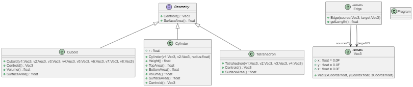

# Explanation of my Implementation

The task was to create a library which allows you to implement different geometric shapes and do calculation, like the surface area, with them.



This is the UML diagram of the entire codebase, I suggest you open the ```include.puml``` file inside the ```plantuml``` folder using the PlantUML extension to have a better viewing experience, as the image below has a very low resolution.

## GeometryLibrary
### Geometry.cs
* This file contains the definition of a few function and the interface from which each shapes inherites them.
```csharp
public interface Geometry
{
  public Vec3 Centroid();

  public float SurfaceArea();
}
```

### Vertex.cs
* This file defines a custom three-dimensional vector that will be used to "create" the shapes.
```csharp
public struct Vec3
{
  // fields
  public float x = 0.0F;
  public float y = 0.0F;
  public float z = 0.0F;

  // constructor
  public Vec3(float xCoords, float yCoords, float zCoords)
  {
    x = xCoords;
    y = yCoords;
    z = zCoords;
  }
}
```

### Edge.cs
* This file handles the custom edge datatype and length calculation.
```csharp
public struct Edge
{
  // fields
  public Vec3 sourceV3;
  public Vec3 targetV3;

  // constructor
  public Edge(Vec3 source, Vec3 target)
  {
    sourceV3 = source;
    targetV3 = target;
  }

  // calculate length between two vertices
  public float getLength()
  {
    float lengthX = Math.Abs(targetV3.x - sourceV3.x);
    float lengthY = Math.Abs(targetV3.y - sourceV3.y);
    float lengthZ = Math.Abs(targetV3.z - sourceV3.z);

    return lengthX + lengthY + lengthZ;
  }
}
```

### Tetrahedron.cs
* Manages shape creation from simple edges and vectors. Implements calculations like the surface area and the centroid, furthermore it overides the ```==``` and the ```!=``` operator to work with it.
```csharp
// constructor
public Tetrahedron(Vec3 v1, Vec3 v2, Vec3 v3, Vec3 v4)
{
  vertices = new Vec3[] { v1, v2, v3, v4 };
  edges = new Edge[] {
    new Edge(v2, v1),
    new Edge(v2, v3),
    new Edge(v1, v3),
    new Edge(v4, v1),
    new Edge(v4, v2),
    new Edge(v4, v3)
  };
}
```

### Cuboid.cs
* Does the same, but in addition also calculates the volume.
```csharp
// volume calucation
public float Volume()
{
  return edges[0].getLength() * edges[1].getLength() * edges[2].getLength();
}
```

### Cylinder.cs
* Again, does the same as the above two shapes, but adds functions for the top and bottom area.
```csharp
// top & botton area caluation (technically the same but having both functions could be more convenient)
public float TopArea()
{
  return (float)Math.PI * (float)Math.Pow(2, Convert.ToDouble(r));
}

public float BottomArea()
{
  return (float)Math.PI * (float)Math.Pow(2, Convert.ToDouble(r));
}
```

## ObjectComputation
### Program.cs
* This file create 5 instances of each shape with random values and performs their surface area calculation, first normally and then using tasks and actions. It also times each execution.
```csharp
// tetrahedron
Random randTet = new Random();

// get a random value for each coordinate
for (int i = 0; i < ObjectCount; i++)
{
  float[] randVal = new float[12];
  for (int j = 0; j < randVal.Length; j++)
  {
    randVal[j] = randFactor * (float)randTet.NextDouble();
  }

  // add them to their list
  tets.Add(
    new Tetrahedron(
      new Vec3(randVal[0], randVal[1], randVal[2]),
      new Vec3(randVal[3], randVal[4], randVal[5]),
      new Vec3(randVal[6], randVal[7], randVal[8]),
      new Vec3(randVal[9], randVal[10], randVal[11])
    )
  );
}

// print out results
foreach (Tetrahedron tet in tets)
{
  Console.WriteLine($"Tetrahedron: {tet.SurfaceArea():#,0.00}");
}
Console.WriteLine("---");
```

```csharp
static object conch = new object();

// get tetrahedron area
static void getTetArea()
{
  lock (conch)
  {
    foreach (Tetrahedron tet in tets)
    {
      Console.WriteLine($"Tetrahedron: {tet.SurfaceArea():#,0.00}");
    }
  }
}
```

```csharp
// handle execution using actions & tasks
static void useTasks()
{
  // begin timer2
  var timer2 = new Stopwatch();
  timer2.Start();

  Task taskTet = new Task(getTetArea);
  taskTet.Start();

  Task taskCuboid = new Task(getCuboidArea);
  taskCuboid.Start();

  Task taskCylinder = new Task(getCylinderArea);
  taskCylinder.Start();

  Task[] tasks = { taskTet, taskCuboid, taskCylinder };
  Task.WaitAll(tasks);

  // stop timer2
  timer2.Stop();

  // handle timer2 result
  TimeSpan timeTaken = timer2.Elapsed;
  string timer2Result = "Time taken: " + timeTaken.ToString(@"m\:ss\.fff");

  Console.WriteLine("---");
  Console.WriteLine(timer2Result);
  Console.WriteLine("---");
}
```

## Result
* The end result is that using action makes the code 6 seconds faster than not using them.
* ca. 15 seconds -> without tasks & actions
* ca. 9 seconds -> with tasks & actions